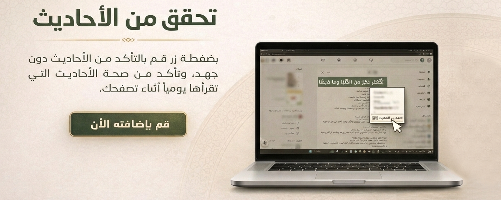
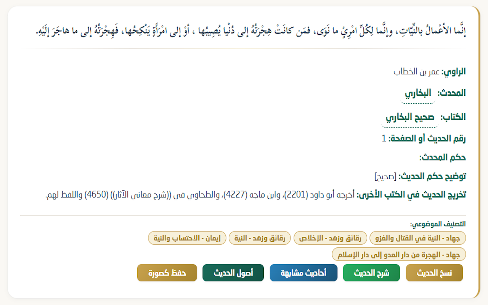
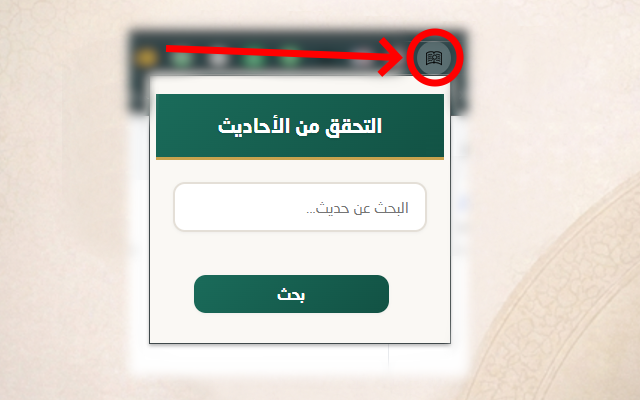
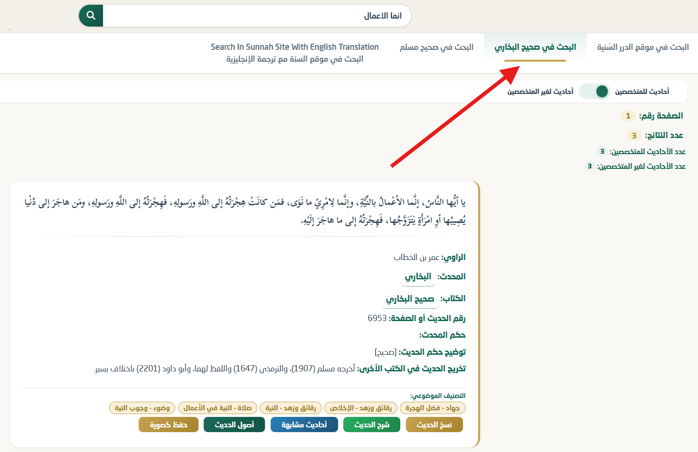
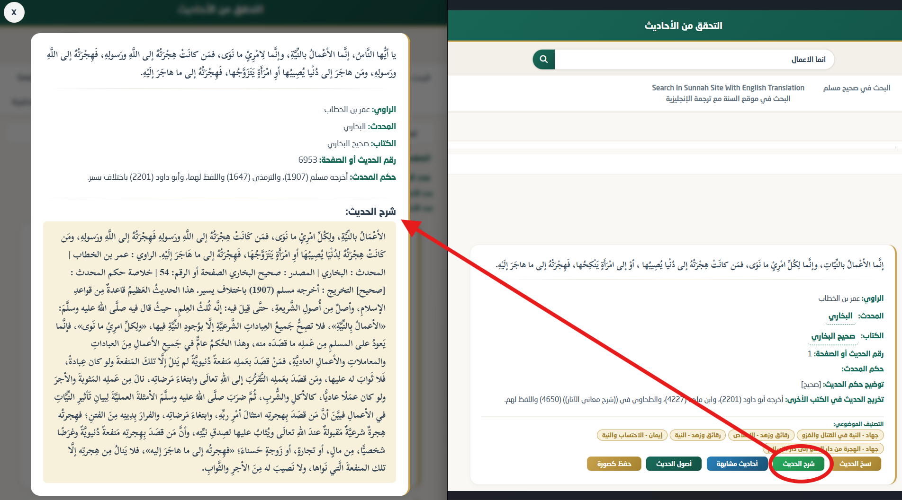
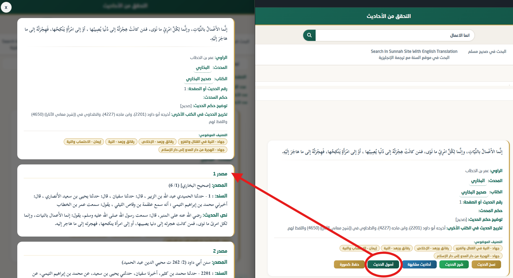
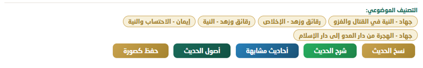
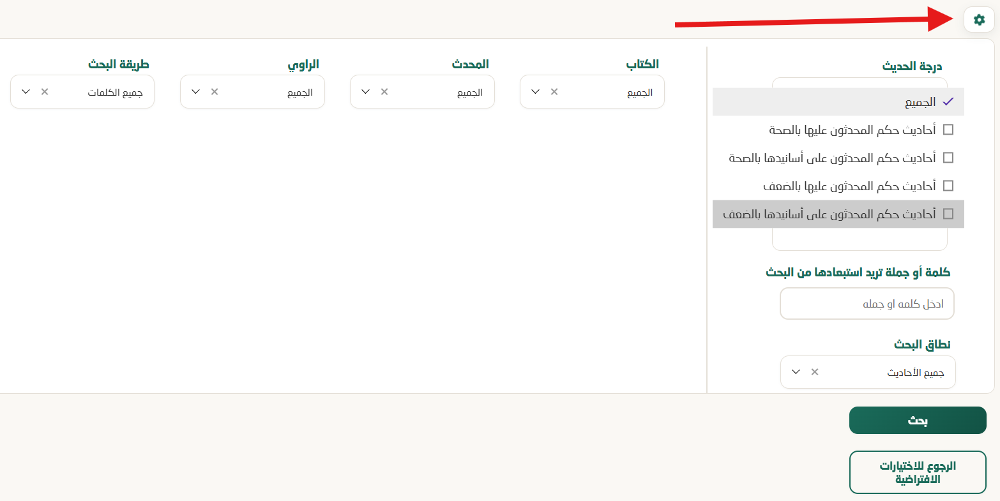
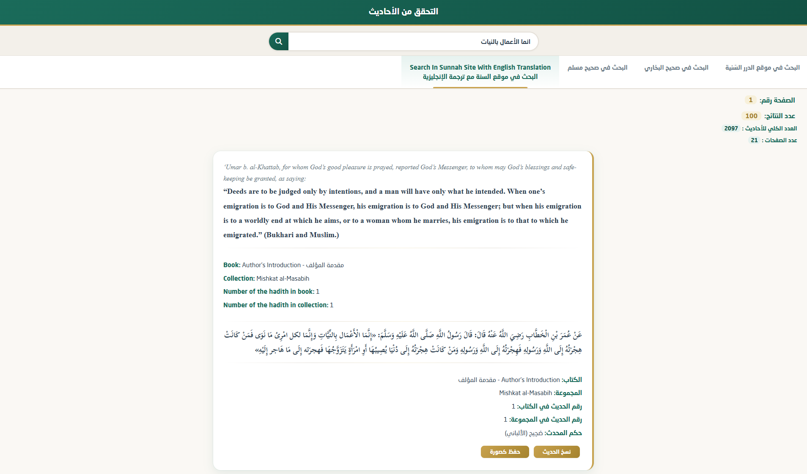

# Hadith Checker Extension

إضافة للمتصفح تستطيع من خلالها أن تتفقد الأحاديث هل هي موضوعة أو صحيحة

تم إنشاء الإضافة بشكل أساسي للغة العربية لأنها تعتمد على موقع dorar.net وهو موقع عربي للأحاديث النبوية  
وبعد فترة اكتشفت موقع sunnah.com الذي يحتوي على ترجمة باللغة الإنجليزية للأحاديث النبوية لذلك قررت أن أعتمد عليه في جانب الغة الإنجليزية

> [!NOTE]
> For English [Click here](https://github.com/AhmedElTabarani/hadith-checker-extension/blob/main/README_ENGLISH.md)

## طريقة الاستعمال

فقط حدد النص واضغط على الزر الأيمن للفأرة ثم اختار خيار `التحقق من الحديث` ثم ستخرج لك نافذة بها `30` نتيجة بحث

يمكنك أيضًا الضغط على الأيقونة لتستطيع أن تبحث عن أي حديث تريده بشكل مباشر

تستطيع اختيار البحث في صحيح البخاري فقط أو صحيح مسلم فقط

تستطيع معرفة شرح الحديث

تستطيع معرفة أصول الحديث ومصادره المختلفة

عند الضغط على زر `أصول الحديث` ستحصل على الحديث الأصلي مع جميع المصادر التي روته مع أسانيدها المختلفة، مما يساعدك في:

- معرفة المصادر المتعددة للحديث الواحد
- مقارنة الأسانيد المختلفة
- فهم طرق رواية الحديث عبر المصادر المختلفة

يمكنك أيضًا الوصول إلى إجراءات إضافية مثل نسخ الحديث ونسخ كصورة وشرح الحديث والحديث الصحيح البديل والأحاديث المشابهة وأصول الحديث

تستطيع تصفية وتغير اختيارات البحث كما يحلو لك

- تحدد طريقة البحث بثلاثة خيارات فقط سواء بـ `جميع الكلمات` أو بـ `أي كلمة` أو بـ `بحث مطابق`
- كلمة أو جملة تريد استبعادها من البحث
- تحديد نطاق البحث بمعنى هل تريد البحث عن `جميع الأحاديث` أم `الأحاديث المرفوعة` أم `الأحاديث القدسية` أم `آثار الصحابة` أم `شروح الأحاديث`
- تحديد درجة الحديث سواء `صحيح` ام `ضعيف`
- تحديد اسماء المحدثين التي تريدهم
- تحديد الكتب التي تريد البحث فيها
- تحديد اسماء الرواة التي تريدهم

لترجمة الإنجليزية يوجد قسم يسمى `البحث في موقع السنة مع الترجمة الإنجليزية`

يستخرج لك `100` نتيجة لكل صفحة

## رابط الإضافة على متجر جوجل كروم

## رابط الإضافة على متجر مايكروسوفت إيدج

## يوجد مشكلة !!

افتح issue إذا قابلت مشكلة ما او لديك اقتراح

## المساهمة

بالطبع نرحب بأي مساهمة لدينا ❤
